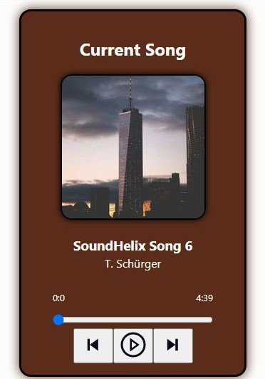

# Music Player App

This project was bootstrapped with [Create React App](https://github.com/facebook/create-react-app).

 

## About
The Music Player App has been made with basic React concepts. It is a simple music player app that allows you to play, pause, skip, and go back to the previous song.

 

## Concepts Learnt:
- react-icons
- react-sound
- IconContext

 

    IconContext is used for changing the format and color of the icons under react-icons.

 

## Output:

 

### Notes:
- Need to add more songs to the playlist.
- Need to be able to change the volume of the song.
- Need to be able to shuffle the songs.
- Need to be able to repeat the songs.
- Can change the names of  songs when adding more songs.